# 00 - Maîtriser les Concepts de Base de la Mise en Réseau

## Introduction à la mise en réseau

La mise en réseau fait référence à la connexion de plusieurs appareils (ordinateurs, serveurs, imprimantes, etc.) afin de partager des ressources et des informations. Dans un monde où la connectivité est primordiale, comprendre les concepts fondamentaux de la mise en réseau est essentiel.

---

## 1. Concepts Fondamentaux de la Mise en Réseau

### 1.1 Qu'est-ce qu'un Réseau ?

Un **réseau** est un ensemble d'appareils interconnectés qui peuvent communiquer entre eux. Les réseaux permettent le partage de ressources (fichiers, imprimantes, etc.) et l'accès à des informations.

[Notion Réseau (Wikipedia)](https://fr.wikipedia.org/wiki/R%C3%A9seau_informatique)

### Le Modèle OSI

Le **modèle OSI** (Open Systems Interconnection) est un cadre théorique qui décrit comment les couches de réseaux interagissent pour permettre la communication entre systèmes informatiques. Il est composé de **sept couches** distinctes, chacune ayant une fonction spécifique. Voici un aperçu de ces couches :

1. Couche Physique

- **Fonction** : Gère la transmission des bits (0 et 1) sur un support physique (câbles, fibres optiques, ondes radio, etc.).
- **Exemple** : Câbles Ethernet, connecteurs, signaux électriques ou optiques.

2. Couche Liaison de Données

- **Fonction** : Assure le transfert fiable des données entre deux machines connectées directement, en gérant la détection et la correction d'erreurs au niveau de la trame.
- **Exemple** : Protocole Ethernet, commutateurs (switches), Wi-Fi (802.11).

3. Couche Réseau

- **Fonction** : Gère le routage des paquets de données entre des réseaux différents, en déterminant le chemin optimal pour acheminer les données.
- **Exemple** : Protocole IP (Internet Protocol), routeurs.

4. Couche Transport

- **Fonction** : Assure la transmission fiable des données d'une extrémité à l'autre, en contrôlant le flux et en assurant la segmentation, le réassemblage des messages, et la gestion des erreurs.
- **Exemple** : TCP (Transmission Control Protocol), UDP (User Datagram Protocol).

5. Couche Session

- **Fonction** : Gère les sessions de communication, c’est-à-dire l’établissement, la maintenance et la fermeture des connexions entre applications.
- **Exemple** : Protocole de session RPC (Remote Procedure Call).

6. Couche Présentation

- **Fonction** : Assure la traduction des données entre le format utilisé par l'application et le format réseau, gérant la compression et le chiffrement si nécessaire.
- **Exemple** : Conversion de formats de données comme XML, JSON, ou le chiffrement/déchiffrement SSL/TLS.

7. Couche Application

- **Fonction** : Interface directe avec les applications utilisateur et assure des services tels que le transfert de fichiers, la messagerie, etc.
- **Exemple** : HTTP (Hypertext Transfer Protocol), FTP (File Transfer Protocol), SMTP (Simple Mail Transfer Protocol).

  

  
  

  

**Types de Réseaux :**

- **LAN (Local Area Network)** :
  
  - **Description** : Un réseau limité à une petite zone géographique (ex. : maison, bureau).
  - **Caractéristiques** :
  
    - Vitesse élevée (jusqu'à 1 Gbps ou plus).
    - Coût relativement faible pour la mise en place.
  
  

  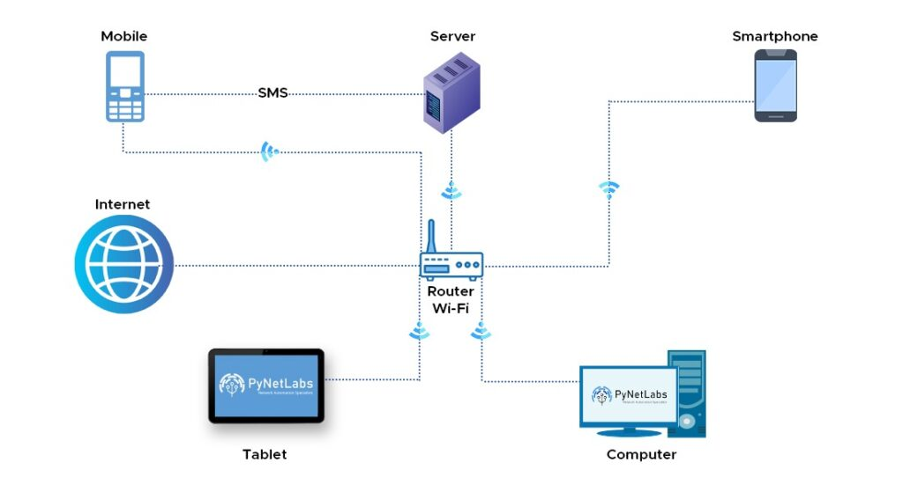
  

  

  
- **WAN (Wide Area Network)** :
  
  - **Description** : Réseau qui couvre de grandes distances, souvent composé de plusieurs LAN.
  - **Caractéristiques** :
  
    - Utilise des technologies comme MPLS, Frame Relay, etc.
    - Peut être public (Internet) ou privé (réseaux d'entreprise).
  
    

    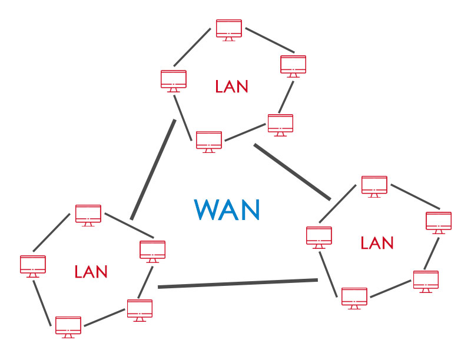
    

    

  
- **MAN (Metropolitan Area Network)** :
  
  - **Description** : Un réseau qui s'étend sur une ville ou une région métropolitaine.
  - **Caractéristiques** : 
  
    - Combine les caractéristiques des LAN et WAN.
    - Utilisé souvent par les entreprises ou les institutions gouvernementales.
  
  

  
  

  

### 1.2 Topologies de Réseau

La **topologie** d'un réseau désigne la manière dont les appareils sont connectés. La topologie influence la performance et la gestion du réseau.

  

  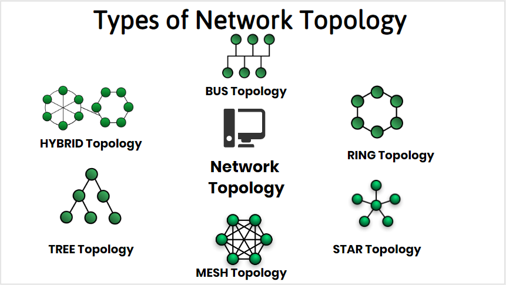
  

  

**Principales Topologies :**

- **Topologie en Étoile** :
  
  - **Description** : Tous les appareils sont connectés à un concentrateur (switch ou routeur).
  - **Avantages** : Facile à installer et à gérer ; si un appareil échoue, le reste du réseau fonctionne toujours.
  - **Inconvénients** : Si le concentrateur échoue, tout le réseau est affecté.

  

  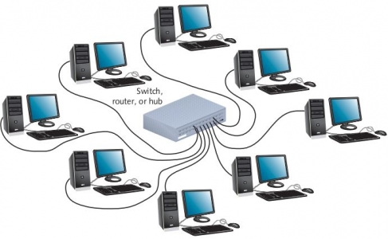
  

  

- **Topologie en Bus** :
  
  - **Description** : Tous les appareils sont connectés à un câble central (bus).
  - **Avantages** : Facile à installer ; nécessite moins de câbles.
  - **Inconvénients** : Si le câble central échoue, tout le réseau est interrompu.

  

  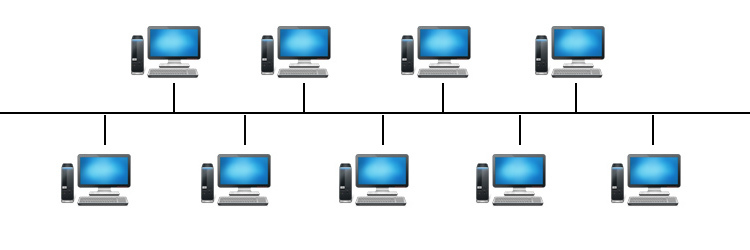
  

  

- **Topologie en Anneau** :
  
  - **Description** : Chaque appareil est connecté à deux autres, formant un cercle.
  - **Avantages** : Données circulent dans une direction, ce qui réduit les collisions.
  - **Inconvénients** : Si un appareil échoue, cela peut affecter tout le réseau.
  
  

  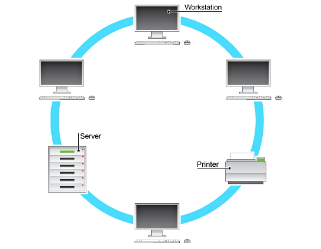
  

  

- **Topologie Maillée** :
  
  - **Description** : Chaque appareil est interconnecté, permettant plusieurs chemins de communication.
  - **Avantages** : Très résilient ; si un chemin échoue, les données peuvent toujours circuler par d'autres chemins.
  - **Inconvénients** : Coûteux et complexe à installer.
  
  

  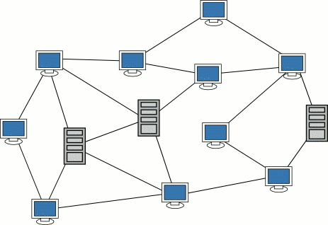
  

  

[Plus sur les topologies de Réseau](https://sti2d.ecolelamache.org/ii_rseaux_informatiques___7_topologie_des_rseaux.html)  

---

## 2. Protocoles de Réseau

Les **protocoles** sont des ensembles de règles qui régissent la communication entre les appareils sur un réseau. Ils assurent la livraison correcte et fiable des données.

### 2.1 Protocoles de Transport

Les protocoles de transport assurent la transmission fiable des données entre les appareils.

- **TCP (Transmission Control Protocol)** :
  
  - **Fonctionnement** : TCP établit une connexion entre deux appareils et garantit la livraison des paquets. Il utilise un mécanisme de contrôle de flux et de correction d’erreurs.
  
  - **Caractéristiques** :
  
    - Orienté connexion : établit une connexion avant d’envoyer des données.
    - Fiabilité : assure que les paquets arrivent dans l’ordre et sans erreur.
  
  

  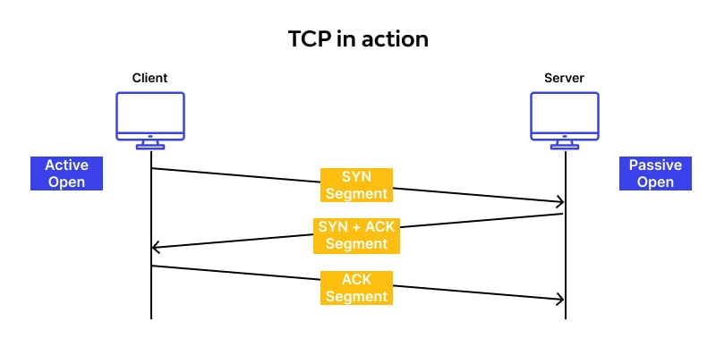
  

  

  
- **UDP (User Datagram Protocol)** :
  
  - **Fonctionnement** : UDP envoie des paquets de données sans établir de connexion au préalable.
  
  - **Caractéristiques** :
  
    - Non orienté connexion : envoie des paquets directement, sans vérification.
    - Rapidité : adapté aux applications où la vitesse est plus importante que la fiabilité (ex. : vidéo en direct).
  
  

  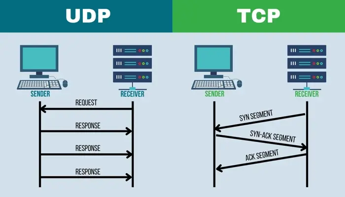
  

  

### 2.2 Protocoles de Réseau

Les protocoles de réseau s’occupent de l’adressage et de l’acheminement des données.

- **IP (Internet Protocol)** :
  
  - **Fonctionnement** : IP divise les données en paquets et les adresse à l’aide d’adresses IP.
  - **Versions** :
  
    - **IPv4** : Utilise des adresses de 32 bits (ex. : 192.168.1.1). Limité à environ 4,3 milliards d'adresses.
    - **IPv6** : Utilise des adresses de 128 bits (ex. : 2001:0db8:85a3:0000:0000:8a2e:0370:7334). Permet un nombre presque illimité d’adresses.
  
  

  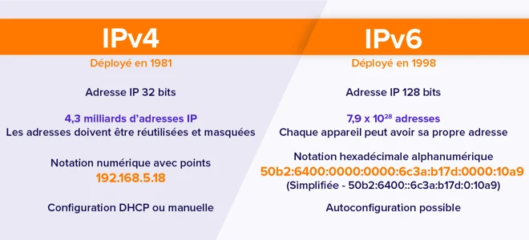
  

  

  
- **ICMP (Internet Control Message Protocol)** :
  
  - **Fonctionnement** : Utilisé pour envoyer des messages d'erreur et des informations de diagnostic.
  - **Exemple** : La commande `ping` utilise ICMP pour vérifier la connectivité entre deux appareils.

  

  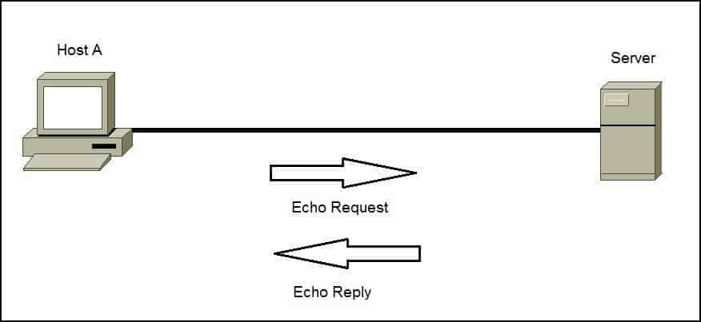
  

  

---

## 3. Interconnexion des Réseaux

### 3.1 Matériel Réseau

Le matériel de réseau est essentiel pour interconnecter des dispositifs.

- **Routeurs** :
  
  - **Fonctionnement** : Achemine les paquets entre différents réseaux en fonction de l'adresse IP.
  - **Caractéristiques** : Peut connecter des réseaux LAN, WAN et Internet.
  
  

  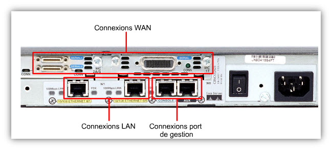
  

  

- **Switches** :
  
  - **Fonctionnement** : Connecte des appareils au sein d'un même réseau, en utilisant des adresses MAC pour acheminer les données.
  - **Caractéristiques** : Fonctionne au niveau 2 du modèle OSI (liaison de données).

  

  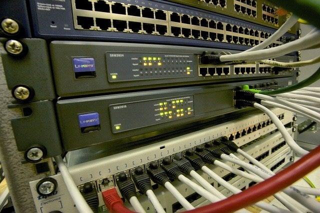
  

  

- **Points d'accès** :
  
  - **Fonctionnement** : Permet aux appareils sans fil de se connecter à un réseau câblé.
  - **Caractéristiques** : Essentiel pour les réseaux sans fil (Wi-Fi).

  

  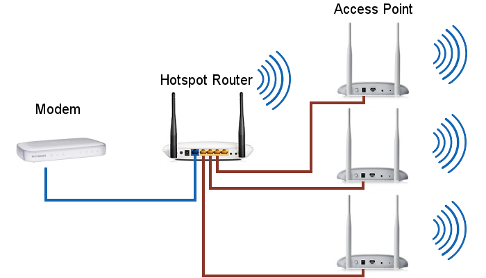
  

  

### 3.2 Types d'Interconnexion

- **Réseaux Privés** :
  
  - **Description** : Réseaux restreints à un groupe d'utilisateurs, protégés par des dispositifs de sécurité (pare-feu, VPN).
  
  

  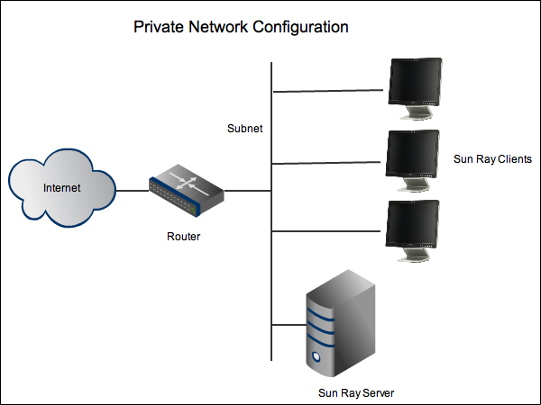
  

  

- **Réseaux Publics** :
  
  - **Description** : Réseaux accessibles à tous, tels qu'Internet.
  
  

  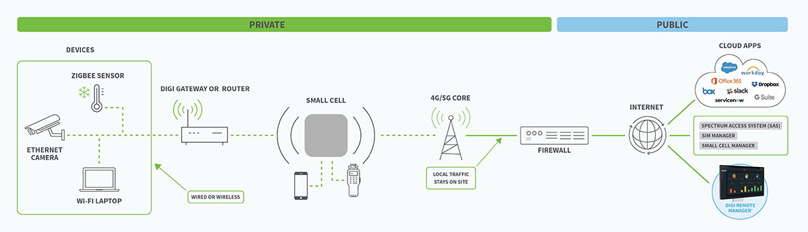
  

  

  
- **VPN (Virtual Private Network)** :
  
  - **Description** : Permet une connexion sécurisée à un réseau privé via Internet.
  - **Fonctionnement** : Crée un tunnel crypté entre l'utilisateur et le réseau privé.

  

  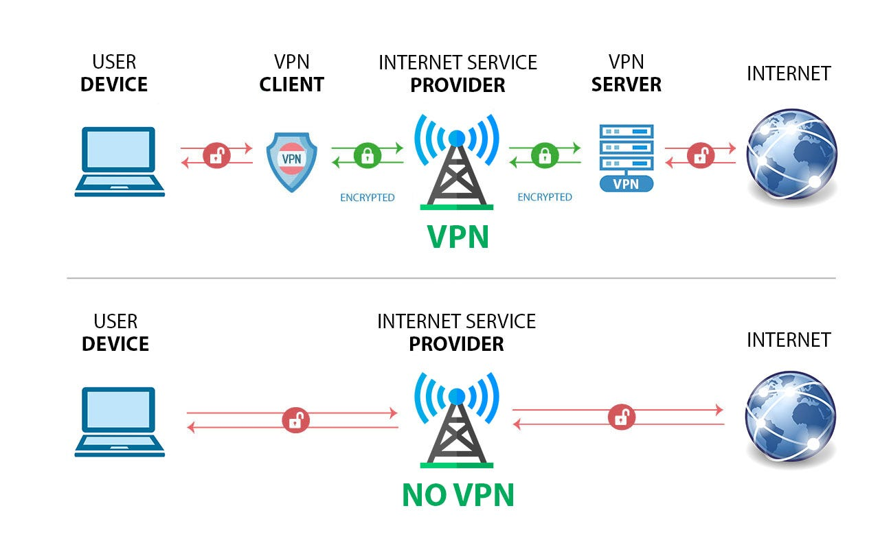
  

  

---

## 4. Sécurité Réseau

La sécurité réseau est cruciale pour protéger les données et les ressources contre les menaces.

### 4.1 Quelques menaces à la Sécurité

- **Virus et Malwares** :
  
  - **Description** : Logiciels malveillants conçus pour nuire à des systèmes informatiques.
  - **Types** : Virus, vers, chevaux de Troie, ransomwares.

  

  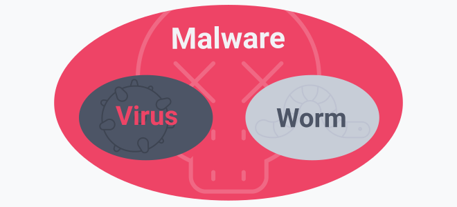
  

  

- **Attaques par déni de service (DoS)** :
  
  - **Description** : Tentatives de rendre un service indisponible en surchargeant un réseau ou un serveur de requêtes.

  

  
  

  

### 4.2 Mesures de Sécurité

- **Pare-feu** :
  
  - **Fonctionnement** : Dispositif qui contrôle le trafic entrant et sortant d'un réseau en se basant sur des règles prédéfinies.
  
  

  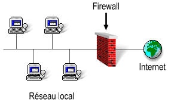
  

  

  
- **Cryptage** :
  
  - **Fonctionnement** : Processus de codage des informations pour les protéger pendant leur transmission.
  - **Exemples** : HTTPS pour le Web, SSL/TLS pour les connexions sécurisées.

  

  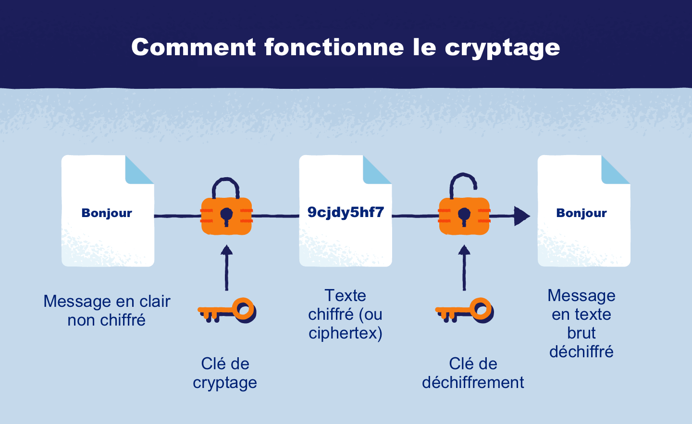
  

  

---

## Conclusion

La mise en réseau est un domaine essentiel pour la communication moderne. En maîtrisant les concepts fondamentaux tels que les types de réseaux, les protocoles, l'interconnexion et la sécurité, vous serez mieux préparé à travailler dans un environnement technologique dynamique et interconnecté.

---

## Ressources Complémentaires

1. **Livres**
   
   - *Computer Networking: A Top-Down Approach* par James Kurose et Keith Ross.
   - *Network+ Guide to Networks* par Jill West, Tamara Dean et Jean Andrews.

2. **Sites Web**
   
   - [Cisco Networking Academy](https://www.netacad.com/)
   - [CompTIA Network+](https://www.comptia.org/certifications/network)
