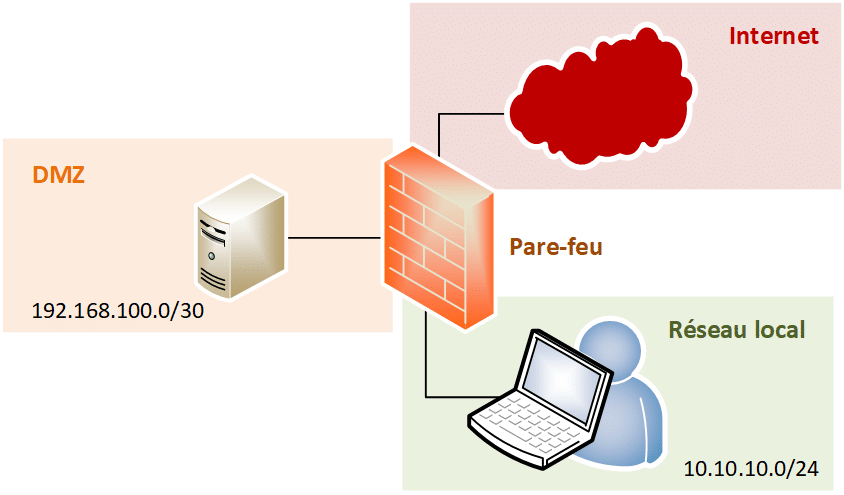
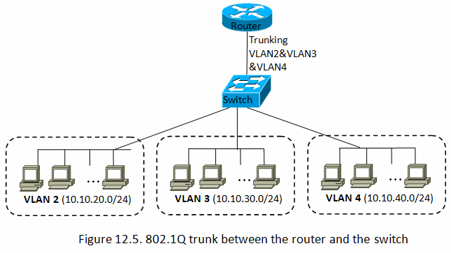
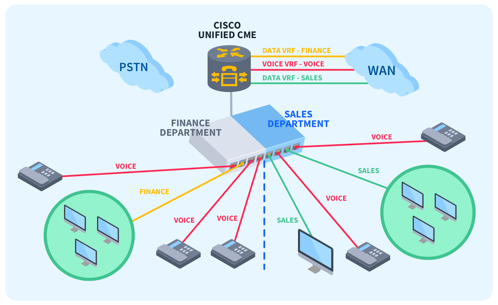

# Sécurité des Réseaux

## Objectifs du Cours

À l'issue de ce cours, vous serez capables de :

1. Comprendre les principes de cloisonnement des réseaux.
2. Identifier les vulnérabilités de la pile ***TCP/IP*** et les meilleures pratiques de sécurisation.
3. Différencier les concepts d'identification et d'authentification, et appliquer des mesures de sécurité pour la gestion des accès.

---

## 1. Principes de Cloisonnement

Le cloisonnement est un concept clé en sécurité des réseaux qui consiste à diviser un réseau en segments isolés afin de réduire les risques d'intrusion et de propagation d'attaques.

### 1.1 DMZ (Zone Démilitarisée)

  
  

La ***DMZ*** est une zone isolée d'un réseau qui expose certains services au public tout en protégeant le réseau interne.

- **Fonctionnement :** 
  
  - La ***DMZ*** sert d'intermédiaire entre Internet et le réseau interne. Les serveurs de la DMZ, comme les serveurs Web ou de messagerie, sont accessibles depuis Internet, tandis que les systèmes internes restent protégés par des pare-feu.

- **Configuration :**
  
  - **Deux Pare-feu :** Utilisation de deux pare-feu pour filtrer le trafic entrant et sortant. Un pare-feu contrôle le trafic vers la DMZ, et l'autre filtre le trafic entre la ***DMZ*** et le réseau interne.
  
- **Avantages :**
  
  - **Isolation des Services :** Limite l'impact d'une éventuelle intrusion sur les serveurs de la DMZ, empêchant l'accès direct au réseau interne.
  - **Surveillance :** Facilite la surveillance du trafic public, permettant une détection plus rapide des anomalies.

### 1.2 VLAN (Virtual Local Area Network)

  
  

Les ***VLANs*** sont des segments logiques d'un réseau local qui isolent le trafic entre différents groupes d'utilisateurs.

- **Fonctionnement :**
  
  - Chaque ***VLAN*** est un sous-réseau distinct. Les appareils d'un ***VLAN*** ne peuvent pas communiquer directement avec ceux d'un autre ***VLAN*** sans un routeur ou un commutateur de niveau 3.

- **Avantages :**
  
  - **Sécurité :** Limite l'accès aux ressources sensibles en isolant le trafic, ce qui réduit la surface d'attaque.
  - **Gestion de la Bande Passante :** Réduit la congestion en séparant le trafic, ce qui améliore les performances globales du réseau.

- **Exemple :**
  
  - Une entreprise pourrait créer un VLAN pour le département des ressources humaines, un autre pour la comptabilité et un troisième pour le marketing, assurant ainsi que les employés n'ont accès qu'aux données pertinentes à leur travail.

### 1.3 VRF (Virtual Routing and Forwarding)

  
  

La ***VRF*** permet de créer plusieurs tables de routage au sein d'un même équipement réseau, isolant ainsi le trafic entre différents clients ou départements.

- **Fonctionnement :**
  
  - Chaque instance ***VRF*** possède sa propre table de routage, permettant une isolation complète du trafic entre les différentes instances.

- **Avantages :**
  
  - **Sécurité :** Les clients ou départements peuvent avoir leurs propres réseaux sans interférences, ce qui est particulièrement utile dans un environnement multi-tenant.
  - **Optimisation des Ressources :** Évite le besoin de matériels supplémentaires pour créer des réseaux isolés.

- **Cas d'Utilisation :**
  
  - Les fournisseurs de services gèrent souvent plusieurs clients sur la même infrastructure physique, et la VRF permet de segmenter le trafic de manière sécurisée.

### 1.4 Virtualisation

La virtualisation permet de créer des machines virtuelles ***(VM)*** qui partagent les ressources d'un seul serveur physique.

- **Avantages :**
  
  - **Isolation des Environnements :** Chaque VM fonctionne indépendamment, limitant l'impact d'une éventuelle compromission sur l'ensemble de l'infrastructure.
  - **Flexibilité :** Permet de déployer rapidement de nouveaux environnements pour le développement, les tests ou la production.

- **Sécurité :**
  - Les hyperviseurs doivent être sécurisés, et des politiques de sécurité doivent être appliquées aux VM pour protéger les données sensibles.

---

## 2. Sécurité de la Pile TCP/IP

La pile TCP/IP est la base des communications sur Internet et est composée de plusieurs couches : application, transport, Internet et liaison.

### 2.1 Vue d'Ensemble de la Pile TCP/IP

- **Couches de la Pile :**
  
  - **Application :** Protocole ***HTTP***, ***FTP***, ***SMTP***.
  - **Transport :** Protocole ***TCP***, ***UDP***.
  - **Internet :** Protocole ***IP***, ***ICMP***.
  - **Liaison :** Protocole ***Ethernet***, ***Wi-Fi***.

### 2.2 Vulnérabilités de la Pile TCP/IP

- **Attaques par Déni de Service (DoS) :**
  
  - Exploitent les ressources limitées de la pile ***TCP/IP***, par exemple, en inondant un serveur de requêtes.

- **Spoofing d'Adresse IP :**
  
  - Les attaquants peuvent falsifier l'adresse IP source pour masquer leur identité et contourner les mécanismes de sécurité.

- **Attaques par Injection :**
  
  - L'injection de paquets malveillants dans le flux de données peut compromettre la sécurité, permettant des attaques comme le ***TCP SYN Flood***.

### 2.3 Mesures de Sécurisation

- **Filtrage de Paquet :**
  
  - Configurer des pare-feu pour filtrer le trafic sur la base de règles définies, bloquant ainsi les paquets indésirables et malveillants.

- **Chiffrement :**
  
  - Utiliser des protocoles de chiffrement comme ***IPsec*** ou ***SSL/TLS*** pour sécuriser les communications à travers la pile ***TCP/IP***.

- **Protocoles de Sécurité :**
  
  - Utiliser des protocoles comme ***HTTPS (HTTP sécurisé)***, ***SSH (Secure Shell)***, et ***SFTP (SSH File Transfer Protocol)*** pour des communications sécurisées.

- **Segmentation du Réseau :**
  
  - La segmentation réduit la surface d'attaque en isolant les systèmes critiques des autres parties du réseau.

---

## 3. Gestion des Accès

La gestion des accès est essentielle pour protéger les ressources du réseau. Elle implique l'identification, l'authentification et l'autorisation des utilisateurs.

### 3.1 Identification vs Authentification

- **Identification :** 
  
  - Processus par lequel un utilisateur se présente à un système (par exemple, en fournissant un nom d'utilisateur).

- **Authentification :**
  
  - Processus de vérification de l'identité d'un utilisateur (par exemple, en demandant un mot de passe ou une authentification biométrique).

- **Différence :**
  
  - Identification est le fait de dire qui vous êtes, tandis que l'authentification est le fait de prouver que vous êtes vraiment cette personne.

### 3.2 Authentification Forte

- **Définition :**
  
  - L'authentification forte nécessite plusieurs méthodes d'authentification, renforçant ainsi la sécurité.

- **Exemples :**
  
  - **Authentification Multi-Facteurs (MFA) :**
  
    - Combine plusieurs méthodes d'identification, par exemple, un mot de passe et un code envoyé par SMS.
  
  - **Certificats Numériques :**
  
    - Utilisation de certificats pour authentifier des appareils ou utilisateurs, souvent dans des contextes tels que le VPN ou l'accès aux systèmes critiques.

### 3.3 Accès Distants Sécurisés

#### 3.3.1 VPN (Réseau Privé Virtuel)

- **Fonctionnement :**
  
  - Le ***VPN*** crée un tunnel sécurisé entre l'utilisateur et le réseau de l'entreprise, chiffrant toutes les données échangées.

- **Avantages :**
  
  - **Confidentialité :** Les données sont protégées des interceptions.
  - **Accès Sécurisé :** Les utilisateurs peuvent accéder aux ressources de l'entreprise comme s'ils étaient sur le réseau local.

- **Types de VPN :**
  
  - **VPN à distance :** Pour les utilisateurs individuels accédant au réseau depuis l'extérieur.
  - **VPN site-à-site :** Pour connecter deux réseaux différents.

#### 3.3.2 Bastions

- **Définition :**
  
  - Un bastion est un serveur configuré pour servir de point d'accès sécurisé au réseau interne, souvent utilisé pour l'accès distant.

- **Fonctionnement :**
  
  - Les utilisateurs se connectent au bastion, qui, à son tour, les connecte aux systèmes internes. Cela permet de surveiller et de contrôler les accès de manière centralisée.

- **Avantages :**
  
  - **Centralisation de la Sécurité :** Facilite la gestion des connexions et des accès, et permet une surveillance centralisée des activités.

### 3.4 Gestion des Identités Numériques

- **Définition :**
  
  - La gestion des identités numériques englobe la création, la gestion et la suppression des identités utilisateurs au sein d'une organisation.

- **Systèmes IAM (Identity and Access Management) :**
  
  - Solutions qui permettent de gérer les identités, les rôles et les accès des utilisateurs de manière centralisée, garantissant que seuls les utilisateurs autorisés peuvent accéder aux ressources nécessaires.

- **Meilleures Pratiques :**
  
  - **Principle of Least Privilege (PoLP) :**
    - Limiter les droits d'accès des utilisateurs à ce qui est strictement nécessaire pour effectuer leur travail.
  - **Revues Périodiques des Accès :**
    - Effectuer des audits réguliers pour s'assurer que les droits d'accès des utilisateurs sont appropriés et à jour.

---

## 4. Conclusion

### 4.1 Récapitulatif des Points Clés

- Le cloisonnement est essentiel pour limiter l'impact des intrusions et améliorer la sécurité du réseau.
- La pile ***TCP/IP*** présente des vulnérabilités qui nécessitent des mesures de sécurisation appropriées pour protéger les communications.
- Une gestion des accès efficace repose sur des pratiques d'identification et d'authentification solides, ainsi que sur des technologies comme les ***VPN*** et les systèmes de gestion des identités.

### 4.2 Ressources Recommandées

- **Livres :**
  
  - *Network Security Essentials* par William Stallings
  - *Security Engineering* par Ross Anderson
  - *Cybersecurity Essentials* par Charles J. Brooks, Christopher Grow, et Philip Craig

- **Sites Web :**
  
  - [NIST Cybersecurity Framework](https://www.nist.gov/cyberframework) : Normes et lignes directrices pour la gestion de la cybersécurité.
  - [OWASP](https://owasp.org) : Pour des ressources sur les bonnes pratiques de sécurité des applications.
  - [SANS Institute](https://www.sans.org) : Formations et ressources sur la cybersécurité.

---

Ce cours fournit un cadre complet pour la compréhension des principes de cloisonnement, de la sécurité de la pile TCP/IP et de la gestion des accès dans le contexte de la sécurité des réseaux. Les étudiants devraient être en mesure d'appliquer ces concepts pour renforcer la sécurité des infrastructures réseau de leur organisation.
