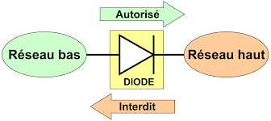

# Sécurité des Données et Fonctions de Sécurité Réseau

## Objectifs du Cours

À l'issue de ce cours, vous serez capables de :

1. Comprendre le cycle de vie des données et les mesures de sécurité associées.
2. Identifier les différentes méthodes de sauvegarde, d'archivage et de chiffrement des données.
3. Expliquer les fonctions de sécurité réseau, y compris les systèmes de gestion des informations de sécurité (SIEM) et les diodes réseau.

---

## 1. Sécurité des Données

### 1.1 Cycle de Vie des Données

  
  

Le cycle de vie des données décrit les différentes étapes que traversent les données, depuis leur création jusqu'à leur destruction. Chacune de ces étapes présente des vulnérabilités potentielles et nécessite des mesures de sécurité spécifiques.

#### 1.1.1 Étapes du Cycle de Vie

1. **Création :**
   
   - **Description :** Les données sont générées, que ce soit par des utilisateurs, des capteurs ou des applications.
   - **Risques :** Les données créées peuvent être incomplètes ou incorrectes, ce qui peut entraîner des problèmes de qualité des données.
   - **Mesures de Sécurité :** Validation des données à l'entrée et utilisation de contrôles d'intégrité.

2. **Stockage :**
   
   - **Description :** Les données sont stockées dans des bases de données, des systèmes de fichiers ou des solutions cloud.
   - **Risques :** Perte de données due à des pannes matérielles ou à des violations de la sécurité.
   - **Mesures de Sécurité :** Utilisation de systèmes de gestion des bases de données sécurisés, chiffrement des données au repos.

3. **Utilisation :**
   
   - **Description :** Les données sont consultées et modifiées par les utilisateurs ou les systèmes.
   - **Risques :** Exposition des données sensibles lors de l'utilisation.
   - **Mesures de Sécurité :** Gestion des accès basée sur des rôles (RBAC), audits des accès aux données.

4. **Partage :**
   
   - **Description :** Les données peuvent être partagées avec d'autres utilisateurs ou systèmes, ce qui peut introduire des risques de sécurité.
   - **Risques :** Fuites de données dues à des partages non autorisés.
   - **Mesures de Sécurité :** Politiques de partage des données claires, outils de classification des données.

5. **Archivage :**
   
   - **Description :** Les données qui ne sont plus activement utilisées sont transférées vers un stockage à long terme.
   - **Risques :** Perte d'accès aux données archivées ou violations de la sécurité.
   - **Mesures de Sécurité :** Chiffrement des données archivées, stockage sécurisé hors ligne.

6. **Destruction :**
   
   - **Description :** Les données sont supprimées de manière sécurisée pour éviter toute récupération non autorisée.
   - **Risques :** Récupération de données supprimées par des tiers malveillants.
   - **Mesures de Sécurité :** Utilisation de logiciels de suppression sécurisée, vérification de la destruction physique des supports.

### 1.2 Sauvegarde

La sauvegarde des données est un processus essentiel pour protéger les informations contre la perte ou la corruption. Une sauvegarde bien planifiée peut faire la différence lors d'un incident de sécurité.

#### 1.2.1 Types de Sauvegarde

  
  

- **Sauvegarde Complète :**
  
  - **Description :** Une copie complète de toutes les données à un moment donné.
  - **Avantages :** Restauration rapide et facile.
  - **Inconvénients :** Prend beaucoup de temps et d'espace de stockage.

- **Sauvegarde Incrémentielle :**
  
  - **Description :** Sauvegarde uniquement les données modifiées depuis la dernière sauvegarde.
  - **Avantages :** Économise du temps et de l'espace de stockage.
  - **Inconvénients :** La restauration nécessite la dernière sauvegarde complète et toutes les sauvegardes incrémentielles.

- **Sauvegarde Différentielle :**
  
  - **Description :** Sauvegarde les données modifiées depuis la dernière sauvegarde complète.
  - **Avantages :** Plus rapide que la sauvegarde complète et plus facile à restaurer que l'incrémentielle.
  - **Inconvénients :** Prend plus d'espace de stockage que l'incrémentielle.

#### 1.2.2 Meilleures Pratiques

- **Planification Régulière :**
  
  - **Description :** Mettre en place un calendrier de sauvegarde régulier (quotidien, hebdomadaire, mensuel).
  - **Exemple :** Sauvegardes quotidiennes pour les données critiques, hebdomadaires pour le reste.

- **Test des Sauvegardes :**
  
  - **Description :** Vérifier régulièrement que les sauvegardes peuvent être restaurées avec succès.
  - **Méthode :** Effectuer des restaurations périodiques dans un environnement de test.

- **Stockage Hors Site :**
  
  - **Description :** Conserver des sauvegardes dans un emplacement distant pour se prémunir contre les sinistres locaux.
  - **Options :** Utilisation de services cloud ou de centres de données externes.

### 1.3 Archivage

L'archivage consiste à déplacer des données qui ne sont plus utilisées vers un stockage à long terme. Cela permet de libérer des ressources tout en préservant les données nécessaires pour la conformité ou l'historique.

#### 1.3.1 Objectifs de l'Archivage

- **Conformité :**
  
  - **Description :** Répondre aux exigences réglementaires de conservation des données, telles que celles imposées par le RGPD ou HIPAA.
  
- **Efficacité :**
  
  - **Description :** Libérer de l'espace sur les systèmes actifs en déplaçant les données anciennes, améliorant ainsi les performances.

- **Accès à Long Terme :**
  
  - **Description :** Garantir que les données sont disponibles pour des besoins futurs, comme les audits ou les analyses.

#### 1.3.2 Méthodes d'Archivage

- **Stockage en Ligne :**
  
  - **Description :** Utilisation de services cloud pour stocker les archives.
  - **Avantages :** Accessibilité, réduction des coûts d'infrastructure.

- **Stockage Hors Ligne :**
  
  - **Description :** Utilisation de supports physiques (disques durs externes, bandes magnétiques) pour stocker des archives.
  - **Avantages :** Sécurité accrue, résistance aux cyberattaques.

### 1.4 Chiffrement

Le chiffrement protège les données en les rendant illisibles pour les utilisateurs non autorisés, assurant la confidentialité et l'intégrité des informations.

#### 1.4.1 Types de Chiffrement

- **Chiffrement Symétrique :**
  
  - **Description :** Utilise la même clé pour le chiffrement et le déchiffrement (ex : AES, DES).
  - **Avantages :** Rapide, nécessite moins de ressources.
  - **Inconvénients :** Problème de distribution de la clé.

- **Chiffrement Asymétrique :**
  
  - **Description :** Utilise une paire de clés, publique pour le chiffrement et privée pour le déchiffrement (ex : ***RSA***, ***ECC***).
  - **Avantages :** Plus sécurisé pour la transmission de données.
  - **Inconvénients :** Plus lent et nécessite plus de ressources.

#### 1.4.2 Meilleures Pratiques

- **Chiffrer les Données Sensibles :**
  
  - **Description :** Appliquer le chiffrement aux données sensibles tant au repos qu'en transit (ex : bases de données, fichiers de configuration).
  
- **Gestion des Clés :**
  
  - **Description :** Mettre en place des procédures pour la création, le stockage et la rotation des clés.
  - **Outils :** Utilisation de systèmes de gestion des clés (KMS) pour automatiser la gestion des clés.

### 1.5 Signature Électronique

La signature électronique est un moyen d'authentifier l'intégrité et l'origine des données numériques, souvent utilisée dans des documents légaux et des transactions commerciales.

#### 1.5.1 Fonctionnement

- **Cryptographie :** Utilise des algorithmes de chiffrement pour créer une signature unique basée sur le contenu d'un document, souvent associée à une clé privée.
  
- **Vérification :** Permet aux destinataires de vérifier l'authenticité du document et d'assurer qu'il n'a pas été modifié depuis sa signature.

#### 1.5.2 Utilisations

- **Contrats Électroniques :**
  
  - **Description :** Validation des accords sans nécessiter de signatures manuscrites, facilitant ainsi les transactions en ligne.

- **Transactions Financières :**
  
  - **Description :** Sécurisation des transactions en ligne pour éviter la fraude.

### 1.6 Empreinte Numérique

L'empreinte numérique fait référence à la trace laissée par une personne ou un organisme sur Internet, influençant souvent la perception de leur sécurité.

#### 1.6.1 Types d'Empreinte Numérique

- **Empreinte Active :**
  
  - **Description :** Informations que l'utilisateur publie volontairement (réseaux sociaux, blogs).
  
- **Empreinte Passive :**
  
  - **Description :** Données collectées sur l'utilisateur sans son consentement explicite (cookies, logs de navigation).

#### 1.6.2 Gestion de l'Empreinte Numérique

- **Surveillance :**
  
  - **Description :** Utiliser des outils pour surveiller et gérer sa présence en ligne.
  - **Outils :** Outils de surveillance de la réputation en ligne.

- **Réduction des Informations :**
  
  - **Description :** Limiter la quantité d'informations personnelles partagées en ligne pour protéger sa vie privée.
  - **Pratiques :** Paramétrer correctement les paramètres de confidentialité sur les réseaux sociaux.

---

## 2. Fonctions de Sécurité Réseau

### 2.1 SIEM (Security Information and Event Management)

  
  

Le ***SIEM*** est une solution qui centralise et analyse les données de sécurité provenant de divers dispositifs pour détecter des menaces potentielles et répondre efficacement aux incidents.

#### 2.1.1 Fonctionnalités

- **Collecte de Logs :**
  
  - **Description :** Agrégation des journaux d'événements provenant de serveurs, pare-feu, systèmes de détection d'intrusion, etc.
  - **Exemples :** Logs d'accès, logs d'application, logs système.

- **Analyse en Temps Réel :**
  
  - **Description :** Surveillance continue des événements pour identifier des comportements anormaux, basés sur des règles prédéfinies ou des modèles d'apprentissage automatique.

- **Rapports et Alertes :**
  
  - **Description :** Génération de rapports de conformité et alertes sur des incidents de sécurité, permettant une réponse rapide.
  - **Exemples :** Alertes de sécurité en temps réel, rapports d'analyse post-incident.

#### 2.1.2 Avantages

- **Détection Précoce des Menaces :**
  
  - **Description :** Identification rapide des activités suspectes avant qu'elles ne causent des dommages, permettant une réaction proactive.

- **Amélioration de la Réponse aux Incidents :**
  
  - **Description :** Facilite la réaction aux menaces en fournissant des informations contextuelles sur les incidents, comme les sources et les impacts.

### 2.2 Diode Réseau

  
  

Une diode réseau est un dispositif qui permet le transfert de données dans une seule direction, souvent utilisé pour protéger les réseaux sensibles contre les intrusions.

#### 2.2.1 Fonctionnement

- **Unidirectionnel :**
  
  - **Description :** Les données peuvent seulement être envoyées d'un réseau à un autre, empêchant ainsi toute connexion inverse qui pourrait introduire des menaces.
  - **Utilisation :** Connecte un réseau moins sécurisé à un réseau hautement sécurisé sans exposer ce dernier.

#### 2.2.2 Utilisations

- **Sécurisation des Environnements Sensibles :**
  
  - **Description :** Utilisée dans des secteurs tels que la défense et la finance pour protéger les données critiques, en empêchant toute entrée non autorisée.

- **Contrôle des Flux de Données :**
  
  - **Description :** Permet de surveiller et de contrôler le transfert d'informations sensibles, garantissant la conformité aux politiques de sécurité.

---

## Dépôt de TP

Veuillez déposer un fichier (.pdf) sur [ce lien](https://classroom.google.com/c/NzIwNDg4OTMyNTk4?cjc=ya2vfva), n'oubliez pas de mentionner votre prénom/nom.

---

## 4. Conclusion

### 4.1 Récapitulatif des Points Clés

- La sécurité des données est essentielle tout au long de leur cycle de vie, et inclut des mesures de sauvegarde, d'archivage, de chiffrement et de signature électronique.
- Les fonctions de sécurité réseau, comme le SIEM et les diodes réseau, jouent un rôle crucial dans la détection et la prévention des menaces.

### 4.2 Ressources Recommandées

- **Livres :**
  
  - *Data Protection and Compliance in Context* par Paul Lambert
  - *Cybersecurity and Cyberwar: What Everyone Needs to Know* par P.W. Singer et Allan Friedman

- **Sites Web :**
  
  - [NIST](https://www.nist.gov) : Ressources sur les normes de sécurité des données.
  - [SANS Institute](https://www.sans.org) : Formations et ressources sur la cybersécurité.

---

Ce cours offre une vue d'ensemble approfondie de la sécurité des données et des fonctions de sécurité réseau. Les étudiants devraient être capables d'appliquer ces concepts pour protéger efficacement les données au sein de leur organisation et utiliser les outils nécessaires pour gérer la sécurité réseau.
